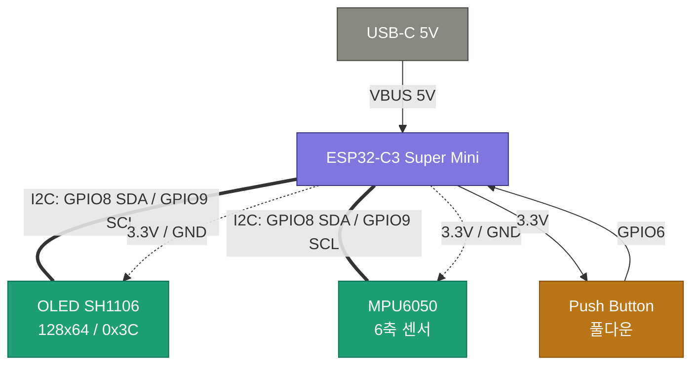

```mermaid
graph TD
    USB["USB-C 5V"]:::pwr
    MCU["ESP32-C3 Super Mini"]:::mcu
    OLED["OLED SH1106<br/>128x64 / 0x3C"]:::dev
    MPU["MPU6050<br/>6축 센서"]:::dev
    BTN["Push Button<br/>풀다운"]:::btn

    USB -->|VBUS 5V| MCU

    MCU ===|"I2C: GPIO8 SDA / GPIO9 SCL"| OLED
    MCU ===|"I2C: GPIO8 SDA / GPIO9 SCL"| MPU

    MCU -.->|3.3V / GND| OLED
    MCU -.->|3.3V / GND| MPU

    BTN -->|"GPIO6"| MCU
    MCU -->|"3.3V"| BTN

    classDef mcu fill:#7F77DD,stroke:#3C3489,color:#fff
    classDef dev fill:#1D9E75,stroke:#0F6E56,color:#fff
    classDef btn fill:#BA7517,stroke:#854F0B,color:#fff
    classDef pwr fill:#888780,stroke:#444441,color:#fff
```